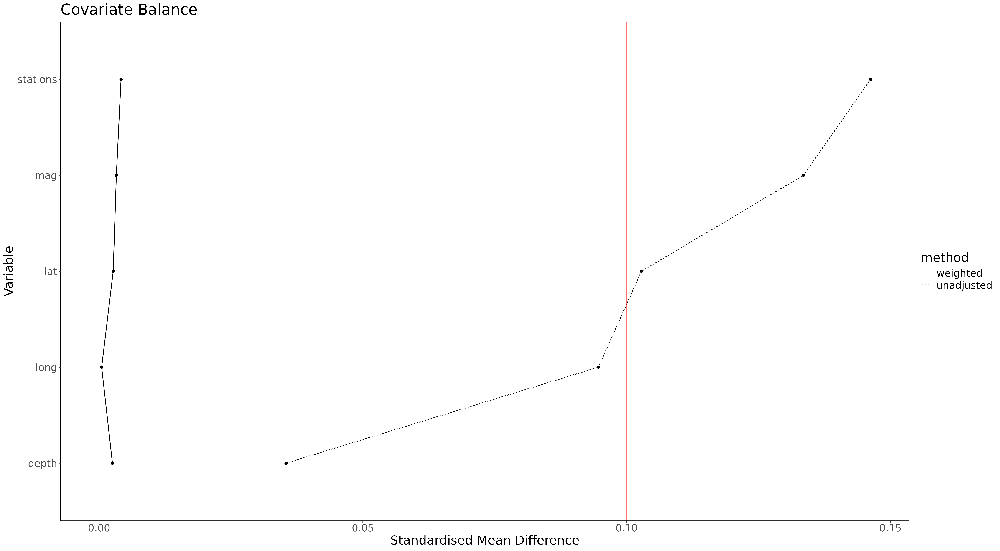

`riptw` is a very versatile R package that easily allows Inverse Probability of Treatment Weighting (IPTW) analysis on R

# Install riptw
Installing `riptw` is as simple as:
```
if (!require("devtools")) install.packages("devtools")
if (!require("BiocManager")) install.packages("BiocManager")
remotes::install_github(
    "cccnrc/riptw",
    repos = BiocManager::repositories()
)
```
If you know a bit of R code (no worries, you don't really need to) you noticed that it only requires [devtools](https://devtools.r-lib.org/) and [BiocManager](https://cran.r-project.org/web/packages/BiocManager/vignettes/BiocManager.html).

The rest of dependencies you need will be installed directly with `riptw`: that's why installation will probably take a while (but you need to perform it only once :wink:)

# Run riptw
Let's try how simple is to use `riptw` on the R built-in dataset [quakes](https://www.rdocumentation.org/packages/datasets/versions/3.6.2/topics/quakes) which comes along R by default
```
library(riptw)

### import the built-in dataset quakes
quakes <- datasets::quakes

### create a fake categorical variable "treatment" to normalize covariates on
quakes$treatment <- sample( c( rep( 0, nrow(quakes)/8*6 ), rep( 1, nrow(quakes)/8*2 ) ))

IPTW <- riptw( data = quakes,
                outcome = 'treatment',
                covariates = c( 'lat', 'long', 'depth', 'mag', 'stations' ) )
IPTW$plot
```
That's all! You now have your IPTW adjusted covariates in the IPTW object.

`IPTW` is the object returned by `riptw()` function, and it is composed of 4 parts:
- *data*: the input database with some new columns:
    - Propensity Score for each treatment variable group (each column starts with `PS_` and is followed by the group name)
    - Inverse Probability of Treatment Weighting (`iptw`) for each sample based on its treatment group
    - Standardised Weights (`sw`): this is what you are really interested in, your dataset [weights](https://www.statology.org/weighted-least-squares-in-r/) to be used in regressions or other analysis you want to operate
- *unadjusted*: covariates stratification table before IPTW-adjustment
- *adjusted*: covariates stratification table after IPTW-adjustment
- *plot*: this is a graphical representation of how normalized IPTW is able to reduce each covariate effect on the treatment variable. Standardised Mean Difference (SMD) for each variable stratification with treatment groups are used for comparison, ***adjusted*** SMD are represented as a continuous line and ***unadjusted*** SMD as a dotted line. The red vertical bar at 0.1 represent the cutoff which is normally used to determine if the variable significantly stratificates with the group, thus is a covariate significantly influencing treatment variable. Here an example from the code above:

